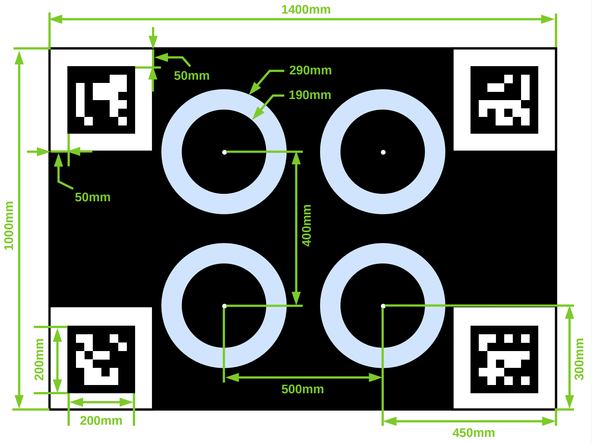

# FAST-Calib2

## LiDAR-Camera Extrinsic Calibration with Reflective Annular Targets

FAST-Calib2 builds upon FAST-Calib as a substantially enhanced target-based extrinsic calibration toolbox for LiDAR-camera systems. It uses a reflective annular calibration target to improve LiDAR center extraction on **low-quality point clouds**, especially for **large-spot solid-state and mechanical LiDARs**.

**Contributions:**

1. A self-designed 3D reflective annular calibration target that avoids center extraction errors caused by hole-edge inflation and bleeding artifacts in previous circular-hole calibration boards.
2. A robust concentric-circle fitting method that uses the fixed inner and outer annulus radii as geometric constraints.
3. Automatic calibration board ROI extraction without manual pass-through tuning.
4. Geometry and radius quality checks for extracted annulus centers.
5. Single-scene and multi-scene LiDAR-camera extrinsic calibration without initial extrinsic parameters.

**Related paper:**

[FAST-Calib: LiDAR-Camera Extrinsic Calibration in One Second](https://www.arxiv.org/pdf/2507.17210)

[FAST-Calib2: LiDAR-Camera Extrinsic Calibration with Reflective Annular Targets](https://github.com/xuankuzcr/FAST-Calib2)

📬 For further assistance or inquiries, please feel free to contact Chunran Zheng at zhengcr@connect.hku.hk.

## 1. Prerequisites

- Ubuntu with ROS Noetic
- PCL >= 1.8
- OpenCV >= 4.0

Build the package in a catkin workspace:

```bash
cd ~/calib_ws && catkin_make && source devel/setup.bash
```

## 2. Calibration Target

FAST-Calib2 uses four reflective annuli and four visual markers on one board. The annuli are used by LiDAR center extraction, while the visual markers are used by the camera pipeline.

Materials:

- Board: PVC
- Reflective annulus stickers: 3M engineering-grade reflective film

Key dimensions:

- Board size: 1400 mm x 1000 mm
- Annulus outer diameter: 290 mm
- Annulus inner diameter: 190 mm
- Annulus center layout: 500 mm x 400 mm

<p align="center">
  
  <font color=#a0a0a0 size=2>Reflective annular calibration target and annotated dimensions.</font>
</p>

## 3. Method Overview

Both LiDAR pipelines first locate the calibration board automatically, fit the board plane, and align the plane to `Z=0`. Center extraction is then performed in the aligned board frame.

Solid-state LiDAR pipeline:

1. Extract high-reflectivity annulus points on the fitted board plane.
2. Cluster annulus points into circle candidates.
3. Fit robust single circles as the default center estimate.
4. Optionally extract annulus boundary points and fit fixed-radius concentric circles.
5. Select the result with better four-center geometry consistency.

Mechanical LiDAR pipeline:

1. Use LiDAR `ring` order to find intensity transition points on the annulus boundary.
2. Try both interpolated boundary points and high-reflectivity-side boundary points.
3. Fit fixed inner/outer radius concentric circles for each annulus cluster.
4. Select four centers using the known 500 mm x 400 mm target geometry.
5. Keep the boundary mode with lower geometry error.

The final quality checks include center-to-center geometry error and annulus radius consistency.

## 4. Run Examples

Prepare static acquisition data in the `calib_data` folder:

- rosbag containing point cloud messages
- corresponding image for camera-LiDAR calibration

Run single-scene calibration:

```bash
roslaunch fast_calib calib.launch
```

After collecting at least three scenes, run multi-scene joint calibration:

```bash
roslaunch fast_calib multi_calib.launch
```

Typical multi-scene target placement:

<p align="center">
  
  <font color=#a0a0a0 size=2>Placement of the calibration target for multi-scene data collection: (a) facing forward, (b) oriented to the right, (c) oriented to the left.</font>
</p>

## 5. Configuration

Main parameters are in `config/qr_params.yaml`:

- `use_auto_lidar_roi`: enable automatic board ROI extraction
- `circle_radius`: annulus centerline radius, default `0.12`
- `annulus_half_width`: half of annulus ring width, default `0.025`
- `delta_width_circles`: horizontal center spacing, default `0.5`
- `delta_height_circles`: vertical center spacing, default `0.4`
- `board_width`, `board_height`: physical board size

## 6. Standalone LiDAR Center Extraction Test

<details>
<summary>Show Unit Test Usage</summary>

The repository also provides a LiDAR-only test tool for checking annulus center extraction before running full camera-LiDAR calibration.

Load parameters:

```bash
rosparam load config/qr_params.yaml /
rosparam set /output_path /home/chunran/02_calib_ws/src/FAST-Calib/output
```

Run solid-state LiDAR data:

```bash
rosrun fast_calib lidar_center_test calib_data/fast-calib2-data/left.bag /livox/lidar solid
rosrun fast_calib lidar_center_test calib_data/fast-calib2-data/mid.bag /livox/lidar solid
rosrun fast_calib lidar_center_test calib_data/fast-calib2-data/right.bag /livox/lidar solid
```

Run mechanical LiDAR data:

```bash
rosrun fast_calib lidar_center_test calib_data/hesai-jt128/left.bag /lidar_points mech
rosrun fast_calib lidar_center_test calib_data/hesai-jt128/mid.bag /lidar_points mech
rosrun fast_calib lidar_center_test calib_data/hesai-jt128/right.bag /lidar_points mech
```

The test tool writes:

- `*_centers.txt`: extracted annulus center coordinates
- `*_debug_cloud.pcd`: board point cloud, annulus points, boundary points, and center markers for visualization

Debug PCD colors:

- Board points: intensity color map
- Annulus points: green
- Solid-LiDAR boundary points: red
- Centers: white spheres

</details>
